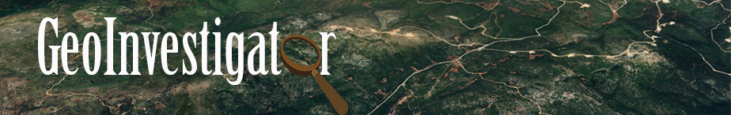
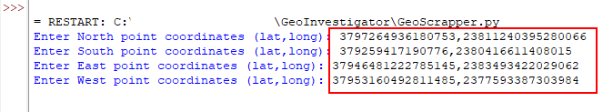
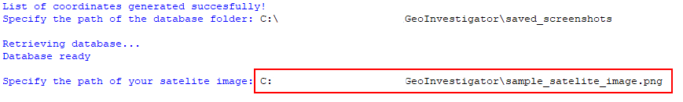
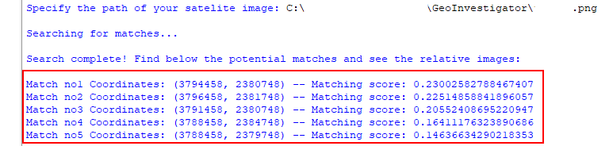

# GeoInvestigator

## Description

> ### Python-based OSINT tool for pinpointing a location solely from satelite imagery - without any other info (address, coordinates etc.) using the cv2 module

 

No address? 
No coordinates? 
No problem.

This application can help you pinpoint a location based only on a satelite image. 

With the use of [GeoScrapper](https://github.com/alexandrosb88/GeoScrapper), an auxiliary python tool, a database is populated with satelite images covering a user-defined broad territory. 

A match, then, is attempted between the user's aerial photo and the aforementioned database utilizing the cv2 image-matching capabilities. Most accurate matches are, finally, presented to the user.

## Usage

> *Click each section to expand*

Defining the search territory

 

Firstly, the user defines the extreme points of the broad area in which the search will be conducted. This is achieved by noting down the coordinates of the nothernmost, southernmost, easternmost and westernmost points.

 

A rectangular area based on the above points will be processed:

Creating the database

 

GeoScrapper, then, saves screenshots from individual magnified regions of the area in order to populate the database. This procedure might take a considerable amount of time depending on the area size:

Upload your satelite image

 

Afterwards, the user is prompted to enter the path of the satelite photo that intends to locate:

See the results

 

Finally, a comparison between the uploaded photo and the satelite photos of the database is performed.

The top 5 matches are then presented to the user for consideration:

The relative aerial images are presented as well:

 

 
<em>(on the left - potential matches / on the right - uploaded image)</em>

## Notes

- Satelite images scaling approx. at 1:10.000 and 1:20.000 seems to get most accurate results.
- The database satelite images are retrieved from Google Maps.
- Chrome browser is used.

## License

This project is licensed under the [MIT License](LICENSE). You are free to use, modify, and distribute this project as per the terms of the license.
